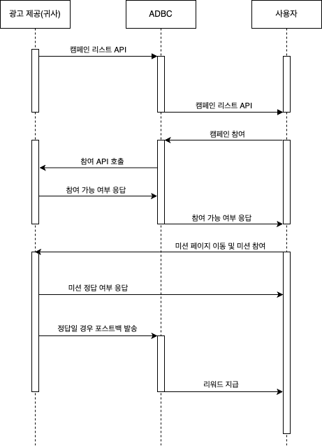

# Reward Campaign API guide for advertiser

### Getting Started

- 본 가이드는 귀사와 ADBC와의 연동을 위한 가이드입니다
- 귀사의 캠페인을 ADBC에게 제공함으로 ADBC의 매체사들에게 캠페인을 노출시킬 수 있습니다
---
### 연동 흐름도



---
# 1.캠페인 리스트 조회 API

- 캠페인 리스트 조회 API는 귀사의 캠페인을 API를 통해 ADBC에게 제공합니다
- method : GET
- content-type : application/json

### 파라미터 정의

- 캠페인 요청시 필요한 파라미터를 정의하여 제공

| 항목      | 설명      | 필수 | 비고                                              |
|---------|---------|----|-------------------------------------------------|
| api_key | 매체사 식별키 | O  |                                                 |

### 응답 정의

- 캠페인 리스트 조회 API의 응답은 아래 예시와 같이 캠페인의 정보를 제공합니다
- 아래는 예시일 뿐이며 항목, 변수명 등 다르게 정의해주셔도 됩니다

| 항목                   | 형태     | 설명                                     | 비고                                     |
|----------------------|--------|----------------------------------------|----------------------------------------|
| result               | int    | 응답 결과 값                                |                                        |
| cnt                  | int    | 캠페인 수                                  |                                        |
| camp                 | array  | 캠페인 리스트                                |                                        |
| camp.campid          | int    | 캠페인 식별값                                |                                        |
| camp.os              | string | 모바일 OS                                 | android, ios                           |
| camp.name            | string | 캠페인명                                   |                                        |
| camp.bm              | int    | 캠페인 유형                                 | CPA, CPE, CPI, CPS 등                   |
| camp.sub_type        | int    | 캠페인 하위 유형                              | 퀴즈맞추기, 플레이스 저장하기, 영상 시청하기, 기타 등등 타입 분류 |
| camp.price           | int    | 캠페인 단가 (=매체비)                          | 100                                    |
| camp.rewarddesc      | string | 캠페인 적립 조건 안내                           | ex) 앱 설치 후 회원가입 완료                     |
| camp.joindesc        | string | 캠페인 참여 방법 안내                           |                                        |
| camp.totalquantity   | int    | 해당 캠페인의 참여 가능한 총 수량                    |                                        |
| camp.quantity        | int    | 해당 캠페인의 일별 참여 가능 수량(=매체사에 할당된 데일리 캡)   |                                        |
| camp.enddate         | string | 캠페인 종료일                                |                                        |
| camp.day_event_limit | int    | 일일 사용자당 참여 가능 횟수                       |                                        |
| camp.iconurl         | string | 캠페인의 아이콘 이미지 url                       |                                        |
| camp.ctv             | array  | 아이콘 이미지를 제외한 가로형, 세로형 소재 정보를 포함하고 있습니다 | 세부 항목 참고                               |

camp -> ctv 세부 항목

| 항목   | 형태     | 설명                            |
|------|--------|-------------------------------|
| type | int    | 1:가로형 소재, 1200*600, 2:1 ratio |
| type | int    | 2:세로형 소재, 720*780             |
| url  | string | 소재 url                        |

#### 응답 예시
```json
{
    "result": 200,
    "cnt": 2,
    "camp": [
        {
          "campid": 415405,
          "name": "A 강남역 맛집 우대포 강남역점 육회 명소 퀴즈맞추기",
          "bm": 1,
          "sub_type": 2,
          "detail_type": "cpc_detail_click_tag",
          "price": 20,
          "price_dollar": 0.014,
          "rewarddesc": "퀴즈 정답 입력하기",
          "joindesc": "[참여방법]\r\n1. 미션 페이지 클릭하기\r\n2. 강남역 맛집 우대포 강남역점 육회 <- 복사하기, \r\n3. 붙여넣기 후 해당 플레이스 클릭 -> 주변 -> 명소 클릭\r\n4. {명소} 1번째 장소는? 단어를 입력 하면 완료!\r\n\r\n\r\n[주의사항] \r\n이미 참여한 이력이 있다면 리워드가 지급되지 않을 수 있습니다. \r\nWIFI가 아닌 환경에서는 데이터 이용료가 발생할 수 있습니다.",
          "totalquantity": 14000,
          "quantity": 2000,
          "enddate": "20240724",
          "targetcarrier": "",
          "targetgender": 0,
          "targetagemin": 0,
          "targetagemax": 0,
          "targetpkg": "",
          "detargetpkg": "",
          "ad_event_limit": 9999,
          "iconurl": "https://webapp.superap.io/res/quiz_icon.png",
          "ctv": [
            {
              "type": 1,
              "url": "https://webapp.superap.io/res/quiz_1200-600_1.png"
            },
            {
              "type": 2,
              "url": "https://webapp.superap.io/res/quiz_720-780_1.png"
            }
          ]
        },
        {
            "campid": 405080,
            "name": "목포 맛집 목포관광오리탕 오리탕 저장하기",
            "bm": 1,
            "sub_type": 1,
            "detail_type": "place_save_home",
            "price": 19,
            "price_dollar": 0.013,
            "rewarddesc": "플레이스 저장하기",
            "joindesc": "[참여방법]\r\n1. 미션 페이지 클릭 -> 플레이스 더보기 클릭 후\r\n2. 홈 메뉴에서 플레이스 저장 하고 저장된 화면 캡쳐하기 \r\n3. 돌아와서 캡쳐화면 업로드 하면 완료! \r\n\r\n\r\n\r\n\r\n[주의사항]\r\n이미 참여한 이력이 있다면 리워드가 지급되지 않을 수 있습니다.\r\nWIFI가 아닌 환경에서는 데이터 이용료가 발생할 수 있습니다.",
            "totalquantity": 6000,
            "quantity": 200,
            "enddate": "20240728",
            "targetcarrier": "",
            "targetgender": 0,
            "targetagemin": 0,
            "targetagemax": 0,
            "targetpkg": "",
            "detargetpkg": "",
            "ad_event_limit": 1,
            "iconurl": "https://webapp.superap.io/res/place_icon.png",
            "ctv": [
              {
                "type": 1,
                "url": "https://webapp.superap.io/res/place_1200-600_2.png"
              },
              {
                "type": 2,
                "url": "https://webapp.superap.io/res/place_720-780_2.png"
              }
            ]
        }
    ]
}
```

---
# 2.캠페인 참여 요청 API


- 광고에 참여하기 위해서는 캠페인 참여 요청 API를 호출해 참여 가능 여부를 확인해야 합니다.
- 캠페인 참여 요청 API를 통해 해당 사용자가 중복으로 참여하는지 확인하고
- 참여 가능한 경우 캠페인에 참여할 수 있는 URL을 응답합니다

### 요청 
- method : GET
- content-type : application/json

### 파라미터 정의

| 항목       | 형태     | 내용                              | 필수 | 비고                                       |
|----------|--------|---------------------------------|----|------------------------------------------|
| api_key  | string | 매체사 식별키                         | O  |
| cbparam  | string | 매체사에서 정의한 파라미터                  | O  | 해당 파라미터에 넣은 값을 포스트백을 통해 다시 전달받을 수 있도록 제공 |
| userid   | string | 참여 유저 식별값 (최대 길이: 100)          | O  |
| campid   | int    | 캠페인 식별값                         | O  |
| adid     | string | AOS = adid, iOS = idfa          | O  |

### 응답
| 항목     | 형태     | 내용                  |
|--------|--------|---------------------|
| result | int    | 처리 결과 코드            |
| lurl   | string | 사용자가 참여할 캠페인 랜딩 URL |

---
# 4.ADBC로 실적 전송

- 사용자가 정상적으로 미션에 참여해 정답을 입력한 경우 ADBC로 포스트백을 발송합니다
- ADBC postback URL : https://postback.adbc.io/reward/{귀사의_영문명}/postback
- method : GET

### 파라미터

| 항목     | 형태     | 설명                   | 비고       |
|--------|--------|----------------------|----------|
| clk_id | string | 캠페인 참여시 보냈던 cbparam값 |          |
| tid    | string | 귀사가 관리하는 트랜잭션 ID     |          |
| userid | string | 참여 유저 식별값            |          |
| price  | int    | 수익금                  |          |


### 예시

<code>
https://postback.adbc.io/reward/my_company/postback?clk_id=123456&tid=abcde&userid=user123&price=100
</code>


## Authors

* **CHOI BAWOO** - *Integration technical support* - bw@adbc.co.kr


